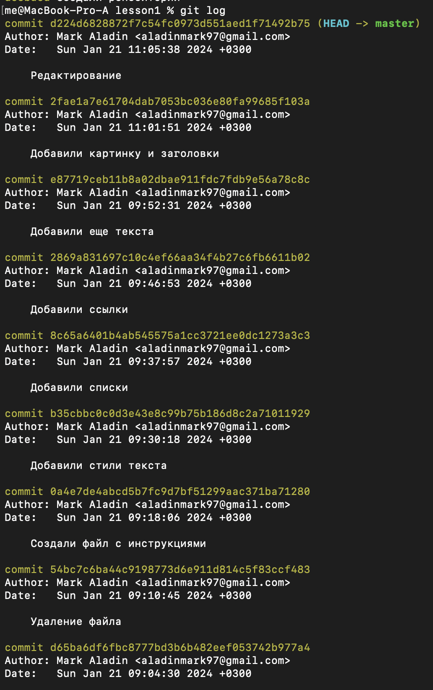
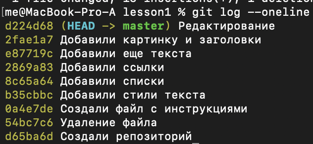
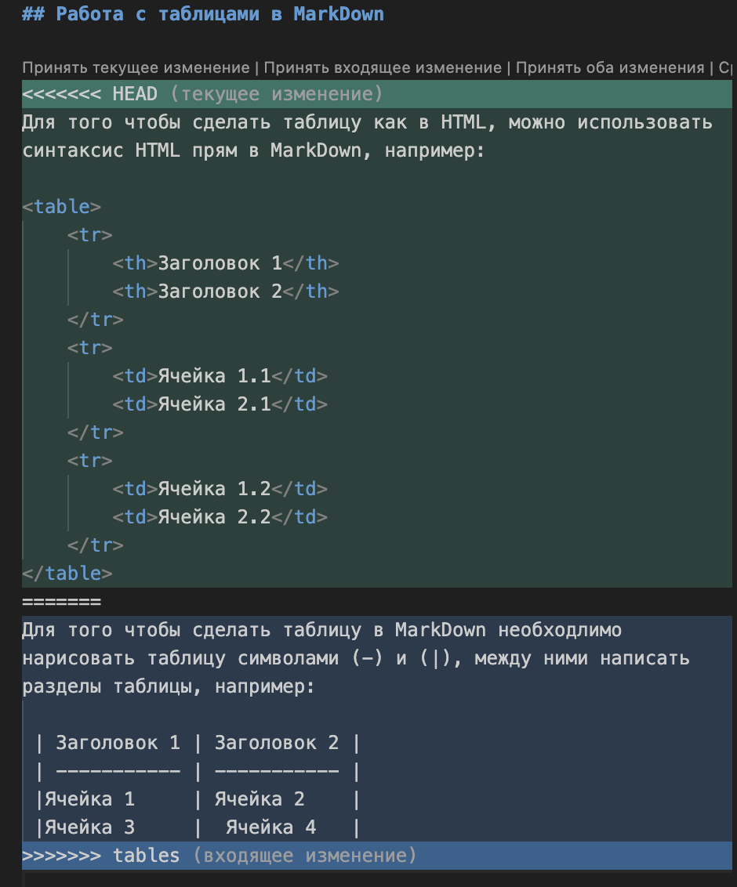

# Подсказка по Git


## Создание репозитория
```sh
git init
```
## Добавление в Git
```sh
git add
```

## Добавление комментария
```sh
git commit -m "message"
```

## Просмотр версий
```sh
git log
```



## Просмотр версий в одну строку
```sh
git log --oneline
```


## Переход к версии 
```sh
git checkout
```

## Переход к последней версии "Head"
```sh
git checkout master 
```

### Больше примеров синтаксиса можно найти по [ссылке](https://gist.github.com/Jekins/2bf2d0638163f1294637 "Переход на сайт с примерами синтаксиса")

## Отображение всех веток

```sh
git branch
```

## Переключение между ветками

```sh
git checkout <имя ветки>
```

## Создание новой ветки

```sh
git branch <имя ветки>
```
## Удаление ветки

```sh
git branch -d <имя ветки>
```

Добавление изменений из ветки

```sh
git merge <имя ветки>
```

Разрешение конфликта



## Работа с удаленными репозиториями

### Клонирование репозитория с GitHub в локальный репозиторий

```sh
git clone <ссылка на репозиторий>
```

### Связывание локального и удаленного репозитория

```sh
git remote add <имя репозитория> link
```

### Отправка версии на удаленный репозиторий

```sh
git push
```

### Отправка версии c удаленного репозитория на локальный

```sh
git pull
```