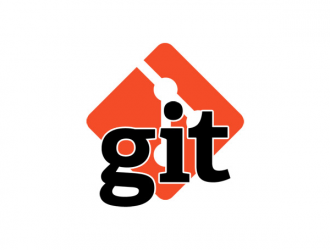

# **Инструкция по работе с Git**
 Создание пустого репозитория (*[документация](https://git-scm.com/docs/git-init)*):
 ```sh
git init
 ```
 Просмотр текущего состояния репозитория (*[документация](https://git-scm.com/docs/git-status)*):
```sh
git status
```

## Создание коммитов
Добавление одного файла в индекс изменений (*[документация](https://git-scm.com/docs/git-add)*):
```sh
git add <file_name>
```
Добавление всех файлов в индеск изменений:
```sh
git add .
```
Сохранение изменений с указанием комментария (*[документация](https://git-scm.com/docs/git-commit)*):
```sh
git commit -m <message>
```

## Работа с историей
Просмотр журнала изменений (*[документация](https://git-scm.com/docs/git-log)*):
```sh
git log
```
Просмотр журнала изменений в более компактном виде:
```sh
git log --oneline
```
Просмотр разницы между текущим состоянием файла и сохраненным (*[документация](https://git-scm.com/docs/git-diff)*):
```sh
git diff
```
Возврат к сохраненной версии файла (все изменения не сохраненные командой git commit пропадут)(*[документация](https://git-scm.com/docs/git-restore)*):
```sh
git restore
```
Переход к другой версии файла (*[документация](https://git-scm.com/docs/git-checkout)*):
```sh
git checkout <number_of_commit>
```
Переход на актуальную версию файла:
```sh
git checkout master
```
Просмотр журнала изменений со списком коммитов в виде красивого графа/дерева:
```sh
git log --graph
```
Просмотр журнала изменений в более компактном виде со списком коммитов в виде красивого графа/дерева:
```sh
git log --oneline --graph
```

## Работа с ветками репозитория
Просмотр доступных веток в репозитории (*[документация](https://git-scm.com/docs/git-branch)*):
```sh
git branch
```
Создание новой ветки:
```sh
git branch <branch_name>
```
Переход на указанную ветку:
```sh
git checkout <branch_name>
```
Удаление указанной ветки:
```sh
git branch -d <branch_name>
```

## Слияние веток
Слияние указанной ветки с текущей на которй находимся (*[документация](https://git-scm.com/docs/git-merge)*):
```sh
git merge <branch_name>
```

## Работа с удаленными репозиториями 
Клонирование удаленного репозитория из GitHub в локальный репозиторий (*[документация](https://git-scm.com/docs/git-clone)*):
```sh
git clone <repository_link>
```
Добавление синхронизации между локальным репозиторием и удаленным репозиторием на GitHub (*[документация](https://git-scm.com/docs/git-remote)*):
```sh
git remote add origin <repository_link>
```
Переименование ветки и определение ее как основной для копирования в удаленный репозиторий на GitHub:
```sh
git branch -M main
```
Загрузка локального репозитория в удаленный репозиторий на GitHub (*[документация](https://git-scm.com/docs/git-push)*):
```sh
git push
```
Загрузка изменений из удаленного репозитория на GitHub в локальный репозиторий (*[документация](https://git-scm.com/docs/git-pull)*):
```sh
git pull
```

## Pull request
**Pull request** - команда для предложения изменений/запрос на вливание изменений в репозиторий.

**Как сделать pull request:**

* Делаем (ответвление) репозитория Fork
* Делаем git clone СВОЕЙ версии репозитория 
* Создаем новую ветку и в НЕЕ вносим свои изменения
* Фиксируем изменения (делаем коммиты)
* Отправляем свою версию в свой GitHub
* На сайте GitHub нажимаем кнопку pull request
