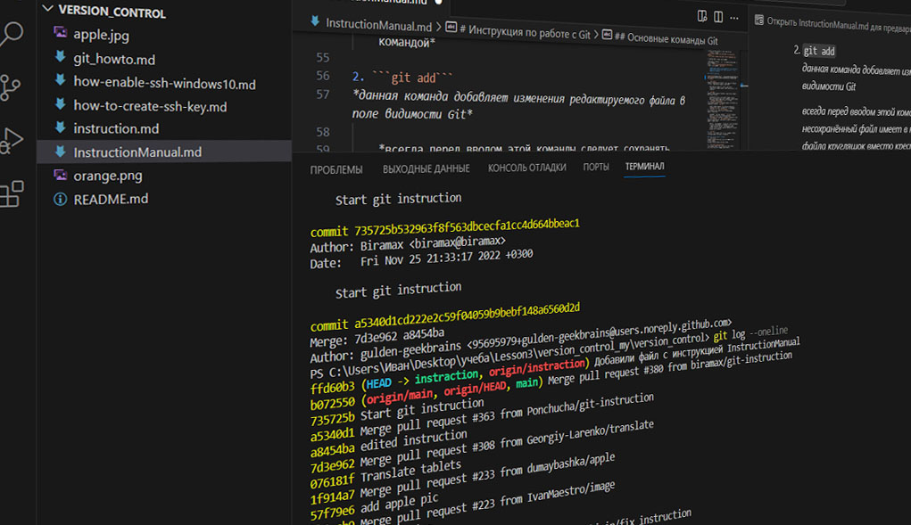
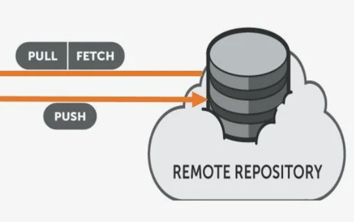

# Инструкция по работе с Git


## Содержание
* запуск Git и вход в нужный репозиторий

* основные команды Git

* команды git по работе с ветками

* команды git по работе с удаленным репозиторием

* Краткий список команд Git

## Запуск git и вход в нужный репозиторий


1. Первым делом следует установить текстовый редактор и программу Git

* *сделать это можно по следующим ссылкам:*  
[программа Git](https://git-scm.com/downloads "для Windows, Linux, MAC")  
[редактор VSCode](https://code.visualstudio.com/Download "для Windows, Linux, MAC")

2. далее запускаем VSCode и инициализируем Git

* *в VSCode создаем папку и файл в этой папке*
* *в VSCode запускаем терминал и в нём инициализируем Git*

     с помощью команды: 
```git init```,
при удачной инициализации терминал не выведет ни каких ошибок
3. Для последующей работы необходимо представиться Git

* *ввести имя пользователя и электронную почту*  
     с помощью команд:  
```git config --global user.name «Ваше имя английскими буквами»```  
```git config --global user.email ваша почта@example.com```

4. Указываем путь к нашей рабочей папке

* *пользуемся командой* ```cd``` *и добавляем полный путь к конечной папке*  
пример: ```cd C:\Users\Иван\Desktop\учеба\Lesson1```
* *повторяем команду* ```git init```

    **Напоминание: *после ввода команд проверяем отсутствие ошибок, при их наличии Git выдает несколько строчек с указанием проблем***

## Основные команды Git



1. ```git status```  
*данная команда позволяет получить информацию по текущему состоянию редактируемого файла и работе Git*  

    *при наличии сомнения корректной работы Git и редактируемого файла следует сразу воспользоваться этой командой*

2. ```git add```  
*данная команда добавляет изменения редактируемого файла в поле видимости Git* 

    *всегда перед вводом этой команды следует сохранять файл, несохранённый файл имеет в названии вкладки справа от названия файла кругляшок вместо крестика*
3. ```git commit -m “message”```  
*эта команда сохраняет все изменения файла до последнего его добавления командой* ```git add```

    *также следует добавлять примечание по выполненным изменениям на момент сохранения в* ```-m “message”```
4. ```git log``` и ```git log --oneline```  
*эти команды выводят список всех сохранений файла зафиксированных Git*  

    *команда* ```git log --oneline``` *выводит урезанный список, состоящий только из последних цифр идентификатора сохранений и сообщений оставленных к ним*
5. ```git checkout``` и ```git checkout master```  
*данные команды позволяют перемещаться между сохранениями зафиксированными Git*

    *после* ```git checkout``` *необходимо вводить последние 7 символов идентификатора сохранения к которому требуется переход, после* ```git checkout master``` *вводить ничего не нужно, переход выполняется к самому актуальному сохранению*

6. ```git diff```  
*с помощью этой команды можно смотреть разницу в текущем содержании файла с последним сохранением*

## Команды Git по работе с ветками


7. ```git branch```  
*данная команда выводит на экран все доступные ветки форматирования*  
*а также выделяет зеленым активную ветку*

8. ```git branch name_new_branch```  
*эта команда создает новую ветку для форматирования*  
*имя ветки должно быть указано без пробелов*

9. ```git checkout name_branch```  
*с помощью данной команды следует перемещаться по веткам форматирования*  
*при этом файл будет иметь последнее сохраненное форматирование в выбранной ветке*

10. ```git merge name_branch```  
*эта команда сливает текущую ветку с той веткой, имя которой вы указываете в команде*  
*при отсутствии конфликтов слияние происходит автоматически*

11. ```git branch -d name_branch```  
*для удаления не нужной ветки воспользуйтесь данной командой*

12. ```git log --graph```  
*команда визуализирует хронологию сохранений во всех ветках*

## Команды git по работе с удаленным репозиторием



## Краткий список команд Git
_____
|название|описание|
|:-:|:-|
|```git init```|инициализация локального репозитория|
|```git status```|получить информацию от git о его текущем состоянии|
|```git add```|добавить файл или файлы к следующему коммиту|
|```git commit -m “message”```|создание коммита|
|```git log```|вывод на экран истории всех коммитов с их хеш-кодами|
|```git log --oneline```|вывод на экран истории всех коммитов в урезанном виде|
|```git checkout```|переход от одного коммита к другому|
|```git checkout master```|вернуться к актуальному состоянию и продолжить работу|
|```git diff```|увидеть разницу между текущим файлом и закоммиченным файлом|
|```git branch```|увидеть все ветки|
|```git branch name_new_branch```|создание новой ветки|
|```git checkout name_branch```|переключение между ветками|
|```git merge name_branch```|объединение изменений из разных веток в одну действующую|
|```git branch -d name_branch```|удаление ветки|
|```git log -- graph```|визуальное отображение хронологии изменений веток|
|||


