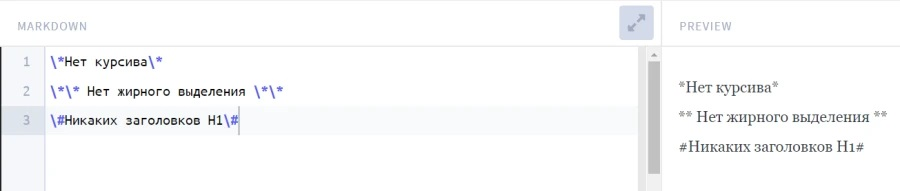

# ИНСТРУКЦИЯ ПО РАБОТЕ С Markdown

# Оглавление
1. Заголовки и горизонтальные линии
2. Выделения текста
3. Списки и отступы
4. Ссылки и изображения
5. Таблицы
6. Цитаты
7. Заключение

# 1. Заголовки и горизонтальные линии
Заголовки Н1-Н6 выделяются в Markdown с помощью знаков решетки (диез/шарп). Можно просто поставить нужное количество решеток в начале строки, чтобы указать уровень заголовка. Или заключить строку с двух сторон. Ниже приведен пример.
# Это H1
## Это H2 ##
### Это H3
#### Это H4 ####
##### Это H5 #####
###### Это H6
Другой вариант: написать текст первого заголовка, затем нажать Enter и на следующей строке указать любое количество знаков «равно». Аналогичным образом можно выделить H2, только использовать уже нужно дефисы. Заголовки других уровней таким методом оформить нельзя.

Это H1 или Заголовок I
===

Это H2 или Заголовок II
---

Если отделить последовательность дефисов пустой строкой, то H2 не будет. Получится горизонтальная разделительная линия. Ее можно оформить также с помощью звездочек или знака нижнего подчеркивания. Количество символов и пробелов между ними роли не играет. А вот знак равенства работает только с заголовками H1, горизонтальные линии он не рисует. 

-----------

***********
___________

# 2. Выделение текста

Чтобы выделить текст курсивом, необходимо обрамить его звездочками (*) или знаком нижнего подчеркивания (_). Например, *вот так* или _вот так_.

Чтобы выделить текст полужирным, необходимо обрамить его двойными звездочками (**) или двойными знаками нижнего подчеркивания (__). Например, **вот так** или __вот так__.

Альтернативные способы выделения текста курсивом или полужирным нужны для того, чтобы мы могли совмещать оба этих способа, т.е. выделять текст одновременно и курсивом, и полужирным. Например, _это может быть **вот так**_.

Чтобы сделать текст зачеркнутым, необходимо обрамить его двойными знаками приблизительно (~~). Это будет выглядеть ~~вот так~~.

# 3. Списки и отступы

Чтобы добавить ненумерованные списки, необходимо пункты выделить звездочкой (*) либо знаком (+), либо знаком (-). Например, вот так:
* Элемент 1
* Элемент 2
+ Элемент 3
+ Элемент 4
- Элемент 5
- Элемент 6

Чтобы добавить нумерованные списки, необходимо пункты просто пронумеровать. Например, вот так:
1. Элемент 1
2. Элемент 2
3. Элемент 3

Маркдаун-разметка также позволяет оформлять многоуровневые списки. Уровень обозначается не количеством спецсимволов, как в случае с заголовками, а за счет отступов. Проще не считать пробелы, а каждый новый подпункт выделять табуляцией.
* Пункт 1
    + Подпункт A
        - Подподпункт a
- Пункт 2
    + Подпункт A
        * Подподпункт a
---

1. Пункт 1
    + Подпункт A
        - Подподпункт a
2. Пункт 2
    1. Подпункт 2.1.
        1. Подподпункт 2.1.1
3. Пункт 3

Если пункт списка включает несколько строк или абзацев, нужно соблюдать всё те же отступы, чтобы было красиво оформлено. Ключевые мысли в списках также можно выделять другой разметкой, например, жирным. Примеры:

* __Тезис №1__

    Раскрываем тезис.

* __Тезис №2__

    Раскрываем тезис.
---

* __Тезис №1__ Раскрываем тезис.

* __Тезис №2__ Раскрываем тезис.

# 4. Ссылки и изображения

Чтобы поставить гиперссылку без анкора, нужно взять URL в угловые скобки (<>). С e-mail – аналогично.
Пример: <https://gb.ru/>.

Если вставлять с анкором, то тогда текст ссылки заключается в квадратные скобки, а адрес страницы – в круглые. Рядом с URL можно прописать тайтл, его объявляют в кавычках (он тоже остается внутри круглых скобок).

Это [https://gb.ru/а]("Geek Brains") с тайтлом.

[Эта ссылка](https://gb.ru/) без заголовка.

<; – а это безанкорная ссылка.

Чтобы вставить в текст изображение, достаточно написать следующее:

# 5. Таблицы

Если поддерживается расширенная версия Markdown, можно вставлять таблицы. Для этого используются всего два символа: вертикальная черта и дефис. Дефисы работают примерно так же, как в случае с горизонтальной линией: отделяют заголовки от других строк, при этом количество символов значения не имеет. Вертикальная черта служит границей между столбцами.

Пример – таблица меток для блоков кода:

| Язык | Метка |

| -----|------|

| Java Script | javascript |

| C++ | cpp|

| HTML | html|

|Markdown|md|

|JSON|json|

|Python|python|

|SQL|sql|

# 6. Цитаты

Если безанкорные ссылки оформляются двумя угловыми скобками, то для цитаты нужна только одна такая скобка. Все очень просто:

> Привет! Это цитата

> Это тоже цитата

> Это еще одна цитата

    Это ее продолжение (показываем отступом)

> Это тоже

Будет

>

> Одна целая цитата

Цитаты вкладываются как в списки, так и в другие цитаты. Цитаты также могут включать в себя заголовки, списки.

# 7. Заключение

Мы разобрали с десяток различных символов, которые используются в разметке Markdown. Но что если эти символы нужны нам в самом тексте? Чтобы спецсимволы не исчезали и не влияли на оформление, нужно использовать экранирование. Как и во многих других языках программирования, этим целям служит обратная косая черта (бэкслеш). Пример на рисунке ниже.

