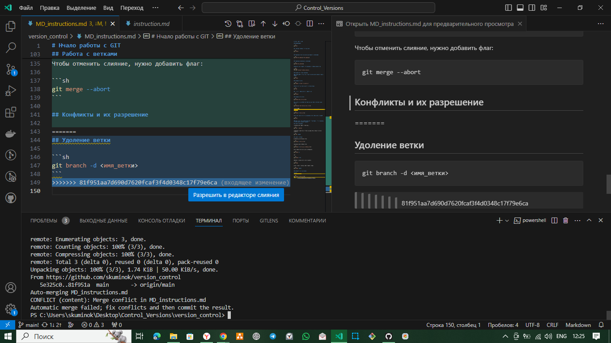

# Нчало работы с GIT

## Инициализация

```sh
git init
```

## Получение текущего состояния Git

```sh
git status

```

## Добавление одного или нескольких фаилов к индексации

```sh
git add <Имя_фаила_1> <Имя_фаила_2>

```

## Добавление *каталога* к индексации  

```sh
git add <Имя_каталога>
```

## Так-же можно добавить все изменения в текущий каталог так

```sh
git add .
("Точка" означает-текущий каталог)
```

## Команда для отмены изменений

### *используется только для отмены коммита или проиндексированого файла*

```sh
git reset
```

## Создание коммита

```sh
git commit -m "Текст комментария"
```

## Вывод истории всех коммитов с их хеш-кодами

```sh
git log
```

## Просмотор списка веток в репозиториях

```sh
git branch
```

## Создание новой ветки

```sh
git branch <Имя_новой_ветки>
```

## Переход к коммиту(по хеш-тегу) или на другую ветку (по имени ветки)

```sh
git checkout <хеш-тег> или <имя ветки> 
```

## Удоление ветки. **Если в ветке есть несущие изменения,не надоеё удолять**

```sh
git branch -d <Имя_ветки>
```

## Для подробного просмотра изменений можно использовать команду

```sh
git diff
```

### Чаще всего эту команду используют чтобы узнать что мы изменили, но *ещё **не проиндексировали***

## Работа сжурналами

выведение информации в одну линию:

```sh
git log -- oneline
```

добавление графической составляющей.Так лучше видна хронология коммитов.

```sh
git log --graph
```

## Работа с ветками

принудительное удоление ветки

```sh
git branch -D <Имя_ветки>
```

Изменение имени текущей ветки

```sh
git branch -m <Новое_имя_текущей_ветки>
```

Вывод списка всех веток,включая удалённые

```sh
git branch -a
```

или

```sh
git branch --all
```

Выполнить слияние веток можно командой:

```sh
git merge
```

Чтобы отменить слияние, нужно добавить флаг:

```sh
git merge --abort
```

## Конфликты и их разрешение

При работе в одном и томже проекте в разных ветках может возникнуть ситуация во время слияния веток, когда изменения в одной ветке "накладываются" на данные в другой ветке.Возникает **конфликт**,который представляет собой решение потребителя.Та же ситуация возникает при коллективнойработе над одним проектом.


На скриншоте видно несколько предложенных вариантов:

* оставить вариант текущей ветки
* принять вариант сливаемой ветки
* принять оба решения
* образец
