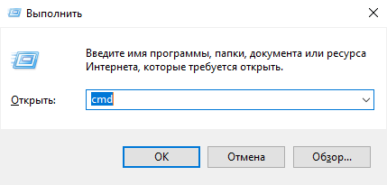
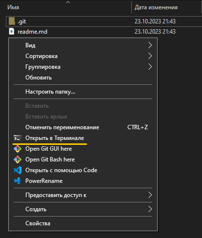
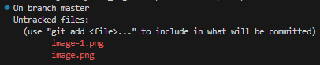
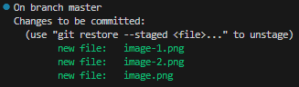
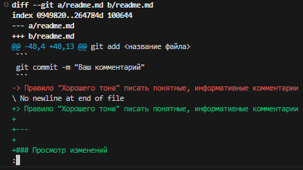
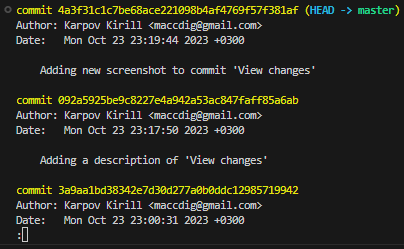
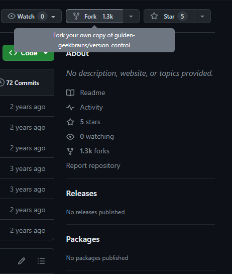
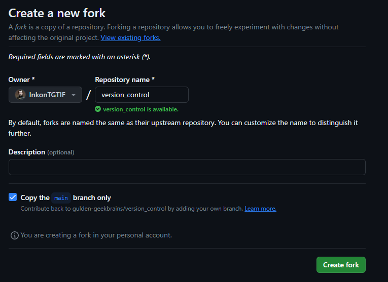

# **Инструкция по работе с Git**

## Ссылка для источник

[InkonTGTIF](https://github.com/InkonTGTIF/GIT_instruction)

# **В этом гайде**

| Тема | Переход |
| --- | --- |
| `Инструкция по установке` | [Ссылки для скачивания](#title1) |
| `git init` | [Создание локального репозитория](#title2) |
| `git status\add ` | [Добавление файлов в репозиторий](#title3) |
| `git commit` | [Коммит изменений + комментарии](#title4) |
| `git diff` | [Просмотр изменений](#title5) |
| `git log` | [Просмотр истории коммитов](#title6) |
| `git checkout` | [Гуляем по коммитам](#title7) |
| `git branch` | [Ветки](#title8) |
| `git push` | [Делаем push](#title9) |
| `fork` | [Вилка?](#title10) |

---

## **Ссылки для скачивания**

| [Windows](https://git-scm.com/download/win) | [Linux/Unix](https://git-scm.com/download/linux) | [macOS](https://git-scm.com/download/mac) |

---

### <a id="title2">Создание локального репозитория **Git**</a>
> Инструкция для Windows.
1. Откройте терминал сочетанием клавиш <kbd>WIN</kbd> + <kbd>R</kbd> и введите:
- cmd



- Или в директории (Папке) - <kbd>ПКМ</kbd> - '*Открыть в Терминале*'



2. Введите команду:
```
git init <Название репозитория>
```

---

Ссылка на официальную документацию [init](https://git-scm.com/docs/git-init)

### <a id="title3">Добавление файлов в репозиторий</a>
- Git отслеживает только те файлы, которые добавлены в репозиторий. Чтобы проверить, какие файлы уже отслеживаются в Git, выполните команду:
```
git status
```
Ссылка на официальную документацию [status](https://git-scm.com/docs/git-status)


> Вывод уведомляет, что есть файлы которые Git не отслеживает.


- Git отслеживает только те файлы, которые добавлены в репозиторий. Если необходимо чтобы Git отслеживал файл, введите команду:
```
git add <название файла>
```
Ссылка на официальную документацию [add](https://git-scm.com/docs/git-add)


> Вывод уведомляет, что Git отслеживает новые файлы.

---

### <a id="title4">Коммит изменений + комментарии</a>
- После добавления новых файлов для индексации, необходимо их зафиксировать. Сделать это можно командой:
```
git commit -m "Ваш комментарий"
```
Ссылка на официальную документацию [commit](https://git-scm.com/docs/git-commit)

> Правило "Хорошего тона" писать понятные, информативные комментарии

---

### <a id="title5">Просмотр изменений</a>
- При работе с Git задумывешься: а те ли изменения ты внес? Чтобы посмотреть какие изменения собираешься закоммитить или просто посмотреть отличия от последнего коммита, необходимо выполнить команду:

```
git diff
```
Ссылка на официальную документацию [diff](https://git-scm.com/docs/git-diff)



---

### <a id="title6">Просмотр истории коммитов</a>
- После того, как вы создали несколько коммитов, вероятно вам понадобится возможность посмотреть что было сделано - *историю коммитов*. Сделать это можно выполнив команду:
```
git log
```
Ссылка на официальную документацию [log](https://git-scm.com/docs/git-log)



> По умолчанию `git log` перечисляет коммиты, сделанные в репозитории в обратном к хронологическому порядке — последние коммиты находятся вверху.

---

### <a id="title7">Гуляем по коммитам</a>

- Для просмотра и внесения изменений в различные версии коммитов есть команда:
```
git checkout <Имя коммита>
```

> В данном случае именем коммита является являет хэш в виде набора символов

- Команда для перехода на другой имеющийся коммит, будет выглядеть примерно  так:
```
git checkout da9ad6c195f4f08f60f2523551a0ba0b6eb26ebd
```
> Git позволяет использовать не полное имя, а только первые ***пять*** символов

- Для того чтобы вернуться к самомцу актуальному состоянию, есть команда:
```
git checkout master
```
Ссылка на официальную документацию [checkout](https://git-scm.com/docs/git-checkout)

---

### <a id="title8">Ветки</a>

- Команда git branch позволяет создавать, просматривать, переименовывать и удалять ветки:
```
git branch
```

---

### <a id="title9">Делайем push</a>

- Команда git push передаёт в удалённый репозиторий изменения, сделанные в локальном репозитории:
```
git push <Ссылка на репозиторий>
```

---

### <a id="title10">Вилка?</a>
- Как бы странно не звучало, но ~~вилка~~ fork это копирование репозитория к себе, выглядит это так
> Для начала необхолдимо на странице репозитория найти кнопку "Fork"




> Далее необходимо указать название репозитория " Repository name* ", который уже будет храниться у Вас и создать его " Create fork "

> По желанию можете добавить комментарий " Description "

