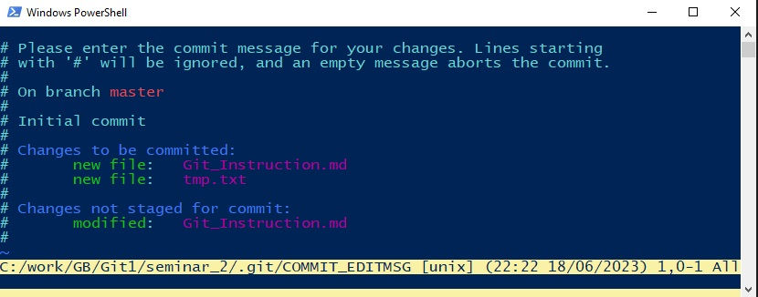

# Подсказка по гиту

## Инициализация репозитория

```sh
git init
```

## Проверка состояния файлов в репозитории
```sh
git status
```

## Добавление измененных файлов в индекс

```sh
git add <имя_файла1>, <имя_файла2>
```
Для добавления всех изменных файлов можно использовать ключ --add

```sh
git add --all

```

## Удаление файлов из индекса

```sh
git rm --cached <имя_файла1>, <имя_файла2>
```

## Фиксация изменений из индекса в историю изменений
```sh
git commit -m "<Комментарий к изменению>"
```
Без ключа -m откроется редактор для ввода многострочного комментария.  
Окно редактора выглядит так  


## Просмотр истории изменений
```sh
git log
```
Или вывод покороче
```sh
git log --oneline
```
Данные других веток можно увидеть с ключем --graph
```sh
git log --oneline --graph
```
Также можно перечислить, лог каких веток помимо текущей, нужно показать
```sh
git log --oneline --graph <имя ветки>
```
## Просмотр изменений между версиям
```sh
git diff <sha коммита 1> <sha коммита 2>
```
## Работа с ветками
### Просмотр списка веток
```sh
git branch
```
### Создание ветки и переключение на нее
```sh
git checkout -b <имя ветки>
```
### Создание ветки без переключения на нее
```sh
git branch <Имя ветки>
```
### Взятие изменений одного коммита из другой ветки
Переключиться на ветку, в которую вливаются изменения
```sh
git cherry-pick <sha коммита>
```
### Объединение веток
Переключиться на ветку, в которую вливаются изменения
```sh
git merge <sha коммита, с которым нужно объединить>
```
### Удаление лишних веток
```sh
git branch -d <Имя ветки>[, <Имя ветки 2....>]
```

## Работа с удаленным репозиторием
### Клонирование удаленного репозитория
```sh
git clone <Адрес репозитория>
```

### Получение изменений из удаленного репозитория
```sh
git pull
```
Получить изменения и сделать rebase своих изменений
```sh
git pull --rebase
```

### Отправить изменения на сервер
```sh
git push
```

### Настроить отправку в удаленную ветку
```sh
git push --set-upstream origin <имя ветки>
```

