# Инструкция для работы с GIT

## Git - это 
> Бесплатная распределенная система контроля версий с открытым исходным кодом, предназначенная для быстрой и эффективной обработки любых проектов, от небольших до очень крупных. Проект был создан Линусом Торвальдсом для управления разработкой ядра Linux, первая версия выпущена 7 апреля 2005 года.

## Создание репозитория
1. Перед началом работы создадим папку и откроем её в *Visual Studio Code*.
2. Запуск командной строки. В меню *Пуск* откроем терминал. На выбор можно запустить *Git CMD* или *Git Bash*, если они у вас имеются.

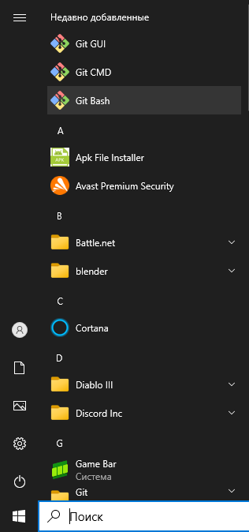

> **Внимание!** Вы не можете получить *Git Bash* изначально в более старых версиях *Windows* - это функция только *Windows 10*. Если же ни того, ни другого у вас нет:
В *Windows 10*, справа от кнопки *Пуск*, в поле поиска вводим команду **cmd**. В контекстном меню появится командная строка:

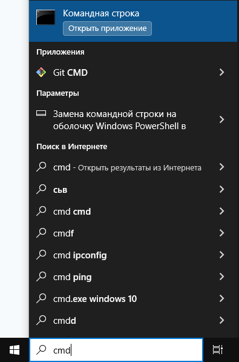

> нажимаем *ПКМ* прямо над ней, чтобы появилось контекстное меню: В этом контекстном меню выбираем "Запуск от имени администратора":
>> Этот запуск нужен для исправления ошибок: <u>«CreateProcess сбой, код 740»</u>, <u>«Запрошенная операция требует повышения»</u>, <u>«Отказано в доступе»</u> и др., возникающих при запуске программ с ограниченными правами.

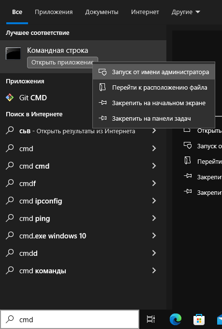

3. Переходим в наш каталог, который ещё не находится под версионным контролем *Git*. Для разных операционных систем это выглядит по-разному:
#### Для Linux:
```sh
$ cd /home/user/my_project
```

#### Для macOS:
```sh
$ cd /Users/user/my_project
```

#### Для Windows:
```sh
$ cd C:/Users/user/my_project
```
или
```sh
$ cd Desktop/my_project/
$ ~/cd Desktop/my_project/
```

4. Набираем команду:
```sh
git --version
```
Если *git* установлен и настроен правильно, то мы должны увидеть в терминале версию гита, если нет, идём на сайт 
[git-scm.com](https://git-scm.com/download/ "Сайт Git"), выбираем свою операционную систему и разрядность, 
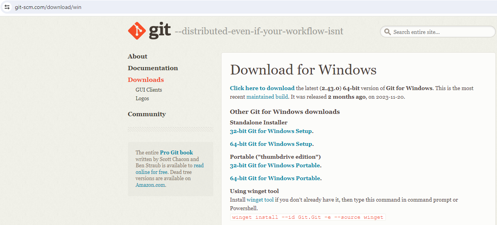
качаем дистрибутив и устанавливаем.

5. Перед тем, как начать пользоваться гитом, необходимо представиться (это формально), указать ему своё имя и email.
Таким образом, те, кто будет просматривать коммиты, будут видеть автора коммита и иметь способ связаться с ним через email. 
### Вводим своё имя
```sh
git config --global user.name "имя_автора"
```
**--global** означает, что правила будут применены ко всем репозиториям на компьютере автора. Если указать **--local**, то для данного репозитория я представлюсь по другому.

### Вводим свой email

```sh
git config --global user.email "email@mail.ru"
```
### Показать текущие настройки
```sh
git config
```
### Показать значение переменной (Имя):
```sh
git config user.name
```
### Показать значение переменной (Email):
```sh
git config user.email
```

6. Выполняем команду для создания в текущем каталоге нового подкаталога с именем **.git**, содержащий все необходимые файлы репозитория — структуру *Git* репозитория:

#### Создание репозитория
```sh
git init
```

> На этом этапе ваш проект ещё не находится под версионным контролем.


## Добавление версионного контроля

Для того, чтобы *git* осуществлял версионный контроль нашего каталога, нам необходимо ему об этом сообщить: 
* Если у нас уже есть файлы, мы должны добавить их в индекс с помощью команды:
```sh
git add <имя_файла.расширение>
```
> Это многофункциональная команда, она используется для добавления под версионный контроль новых файлов, для индексации изменений, а также для других целей, например для указания файлов с исправленным конфликтом слияния.

* Далее мы должны добавить коммит. Коммит фиксирует наши изменения (сохраняет), а также добавляет комментарий, который позволит нам ориентироваться в логе:

### Добавить коммит в новый или изменённый файл
```sh
git commit -m "Message text"
```
Теперь осуществляется версионный контроль нашего каталога и файлов, добавленных в индексацию *git*. Всё, что до сих пор не проиндексировано c помощью *git add* - любые файлы, созданные или изменённые вами, после редактирования - не войдут в этот коммит.

## Нюанс использования *git add* и *git commit*
Допустим, мы проиндексировали и закомитили текущие изменения файла с помощью команд <u>git add <имя_файла.расширение></u> и <u>git commit -m "Message"</u>. 

Затем, если вы измените отслеживаемый файл git_howto.md и после этого снова выполните команду git status, то результат будет примерно следующим:

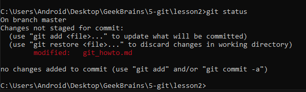

Файл *git_howto.md* находится в секции <u>«Changes not staged for commit»</u> - это означает, что отслеживаемый файл был изменён в рабочем каталоге, но пока не проиндексирован. Чтобы проиндексировать его, необходимо выполнить команду <u>git add <имя_файла.расширение></u> чтобы проиндексировать *git_howto.md*, а затем снова выполним git status:

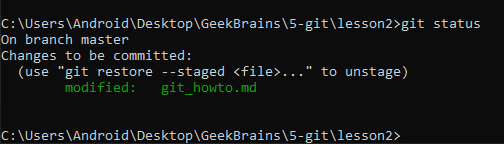

Теперь файл проиндексирован и войдёт в следующий коммит. В этот момент вы, предположим, вспомнили одно небольшое изменение, которое вы хотите сделать в git_howto.md до коммита. Вы открываете файл, вносите и сохраняете необходимые изменения и вроде бы готовы к коммиту. Но давайте-ка ещё раз выполним git status:

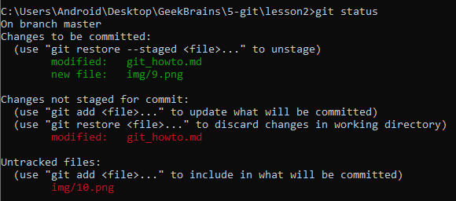

Теперь git_howto.md отображается как проиндексированный и непроиндексированный одновременно. Как такое возможно? Такая ситуация наглядно демонстрирует, что *Git* индексирует файл в точности в том состоянии, в котором он находился, когда вы выполнили команду *git add*. Если вы выполните коммит сейчас, 

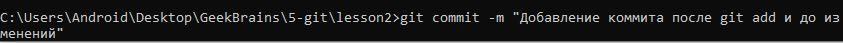

то файл *git_howto.md* попадёт в коммит в том состоянии, в котором он находился, когда вы последний раз выполняли команду *git add*, а не в том, в котором он находится в вашем рабочем каталоге в момент выполнения *git commit*. Если вы изменили файл после выполнения *git add*, вам придётся снова выполнить *git add*, чтобы проиндексировать последнюю версию файла:

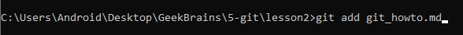
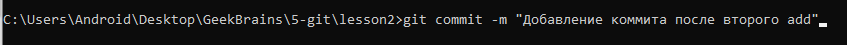

Набрав команду <u>git log --oneline</u> мы увидим два коммита:

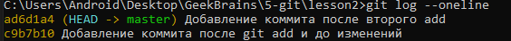

А <u>git status</u> покажет нам, что все коммиты сохранены.

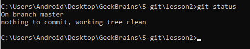


# Команды управления Git-ом

## Git status
Нам потребуется контролировать, все ли файлы отслеживаются, добавлено ли новое содержимое в файле в индексацию. Чтобы посмотреть текущий статус отслеживания, необходимо набрать команду:
```sh
git status
``` 
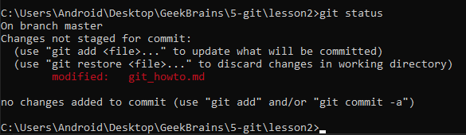

> Красным показано, что файл изменён (modified) и это изменение не было добавлено.

### Пример использования *git status*:
После добавления контента в файл (редактирования) и обновления его индексации:
```sh
git add <имя_файла.расширение>
```
Команда
```sh
git status  
```
Покажет зелёную надпись:

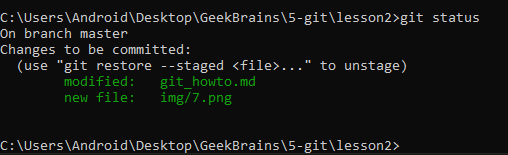

Которая скажет нам, что файл(-ы) модифицирован(ы). В этот момент можно совершить одно из двух действий:
1. Выполнить коммит <u>git commit -m "Message"</u>, версия файла будет добавлена в индексацию. 
2. Навсегда удалить (откатить) текущее состояние файла до момента последнего коммита, с помощью команды:
```sh
git restore <имя_файла.расширение>
```
Которая навсегда удалит ещё не сохранённые данные в файле.

## Git log

Просмотр истории коммитов. 

```sh
git log 
```
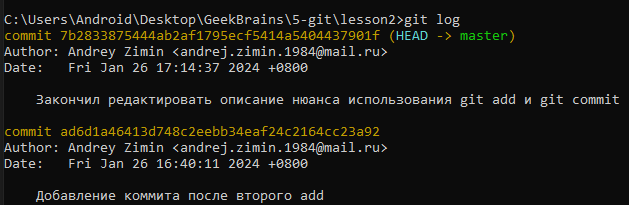

Это полное описание коммитов с хэшем из 40-ка символов для каждого коммита. Под хэшем указывается имя автора коммита и его email, а также дата создания коммита и наш комментарий, которым мы описываем коммит при создании командой <u>git commit -m "Message"</u>. Перечисляет коммиты, сделанные в репозитории, в обратном хронологическом порядке. Коммит, на котором указано (HEAD -> master) говорит о том, что мы находимся на этом коммите.

## Git log --oneline

Просмотр истории коммитов списком, с сокращенным хэшем
```sh
git log --oneline
```


Посмотреть дерево истории коммитов:
```sh
git log --oneline --graph
```
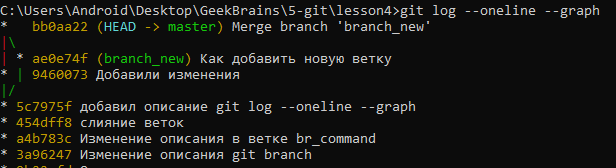

## Git checkout
Переключить ветки или восстановить файлы рабочего дерева:
```sh
git checkout <название_хэша>
```
Эта команда выполняет переход от одного коммита разработки к другому с помощью длинного хэша в *git log* или короткого в <u>git log --oneline</u>. В *git log* также достаточно скопировать от нескольких символов.

### Пример:
Копируем хэш коммита из лога, в который мы хотим перейти, в нашем случае это bd04f59, и вставляем его в команду <u>git checkout <название_хэша></u>:

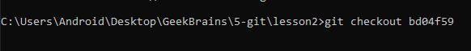

Нас перебрасывает на этот коммит, а изменения откатываются:

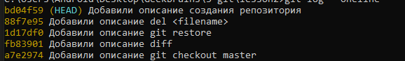

Перейти обратно на прежний коммит можно двумя способами:
1. Если вы набирали команду *git log* до того, как перешли на ранний коммит, то в логах есть полный список коммитов, достаточно скопировать хэш прежнего коммита с пометкой (HEAD -> master) и так же набрать команду <u>git checkout <название_хэша_с_пометкой_мастер></u> и вы вернётесь в прежнее состояние.
2. Набрать команду:
```sh
git checkout master
```
И вы вернётесь на прежний коммит.

## Git diff

Если результат работы команды git status недостаточно информативен для вас - вам хочется знать, что конкретно поменялось, а не только какие файлы были изменены - вы можете использовать команду *git diff*

Показать отличия в файле:
```sh
git diff 
```
Показать отличия в коммитах:
```sh
git diff <имя_коммита> <имя_коммита> 
```

## Del 
Удаление файла в Windows:
```sh
del <filename>
```
Удаление файла в Linux и MacOS:
```sh
rm <filename>
```

## Показать файлы директории
В Windows:
```sh
dir
```
В Linux и MacOS:
```sh
ls
```

## Показать полный текущий путь каталога в Linux и MacOS:
```sh
pwd
```

## Создать папку с именем

```sh
mkdir <имя_папки>
```

## Git branch
Чтобы посмотреть, какие у нас имеются ветки и на какой мы сейчас находимся, наберите команду:
```sh
git branch
```
Создать ветку можно командой:
```sh
git branch <имя_ветки>
```
Перейти в только что созданную ветку:
```sh
git checkout <имя_ветки>
```
Вернуться на главную ветку:
```sh
git checkout master
```
Сделать слияние веток - сначала переходим на ветку *master* с помощью команды **git checkout master**, затем делаем слияние командой:
```sh
git merge <имя_ветки>
```
Удалить ветку можно командой:
```sh
git branch -d <имя_ветки>
```
Обратите внимание! Удалять ветку нужно только после слияния, иначе данные пропадут вместе с удалённой веткой.

## При слиянии веток попали в редактор Wim 
Чтобы выйти из редактора нужно:

1. Нажать клавишу Esc.
2. С зажатым Shift поставить двоеточие, потом добавить символы **wq**

## Разрешение конфликта слияния <u>git merge</u>
При возникновении конфликта слияния от использования команды `git merge <name_branch>` *git* не может сам принять решение, какой файл ему оставить, поэтому он предоставляет выбор разработчику:
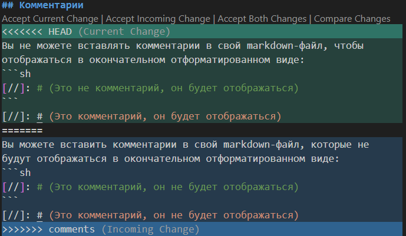

Мы можем выбрать вариант в верхнем меню навигации, где:
1. Accept Current Change - Принять текущие изменения.
2. Accept Incoming Change - Принять входящие изменения.
3. Accept Both Change - Принять оба изменения.
4. Compare Changes - Сравнить изменения.

Подложка, где <u><<<<<<< HEAD (Current Change)</u> является подсказкой, где находятся текущие изменения, а <u><<<<<<< comments (Incoming Change)</u> - входящие изменения (т.е. от пришедшей к нам ветки).

Нам необходимо выбрать одно из двух:
* Нужный вариант в верхнем меню навигации.
* Стереть не нужное

## Работа с удалённым репозиторием

1. Создаём папку локально и открываем её в VSCode.
2. Идём на Github на страницу пользователя, ищём у него нужный репозиторий.
3. Нажимаем кнопку `Fork`. Добавляется копия (вилка) на наш Github аккаунт. Переходим на копию.
4. Смотрим ссылку, нужно, чтобы ссылка была с нашим аккаунтом и названием копии клонированного репозитория, в который хотим предложить свой вклад (Мой_аккаунт/чужой_репозиторий).
5. Нажимаем кнопку `<> Code` и копируем ссылку HTTPS.
6. Открываем терминал, в нём путь к нашей локальной директории.
7. Через терминал клонируем копию вилки (только что созданной копии чужого проекта на нашем аккаунте):
```sh
git clone <ссылка_HTTPS>
```
8. Переходим в клон через терминал.
9. Вносим свои изменения или добавляем файлы.
10. Добавляем новую ветку: `git branch <branch_name>`.
11. Переходим в неё: `git checkout <branch_name>`.
12. И с уже новой веткой вносим в индекс наши правки и изменения через команды: `git add <name_file>` и `git commit -m "Description"`
13. Отправляем на Github наши изменения (сначала они попадут на наш аккаунт, в копию репозитория - вилку):
```sh
git push --set-upstream origin <branch_name>
```
14. Затем, на Github-е появится ветка и её содержимое, которое мы только что добавили с кнопкой `Pull Request`.
15. Жмём кнопку `Pull Request` чтобы предложить автору свои изменения.

## Команды для работы с удалённым репозиторием

Вытолкнуть изменения на удалённый репозиторий:
```sh
git push
```

Вытянуть проект с Github. При этом эта команда попытается смёржить изменения:
```sh
git pull
```

Переименовать ветку master на main 
```sh
git branch -M main
```

Показать привязанный удалённый репозиторий: (fetch) - для считывания, (push) - для записи:
```sh
git remote -v
```

Посмотреть, какой репозиторий задан:
```sh
git remote show
```

Подробное описание удалённого репозитория:
```sh
git remote show origin
```

Отправить (вытолкнуть) все изменения на удалённый сервер origin, ветку main:
```sh
git push -u origin main
```

Удалить ветку на удалённом репозитории:
```sh
git push origin --delete <branch_name>
```

Зафиксировать изменения после разрешения конфликта:
```sh
git rebase --continue
```

Вытянуть удаленный репозиторий для разрешения конфликта: он может возникнуть, если содержимое накладывается друг на друга в удалённом и локальном содержимом. При этом появляется предупреждение **! [rejected]** в терминале:
```sh
git pull --rebase
```