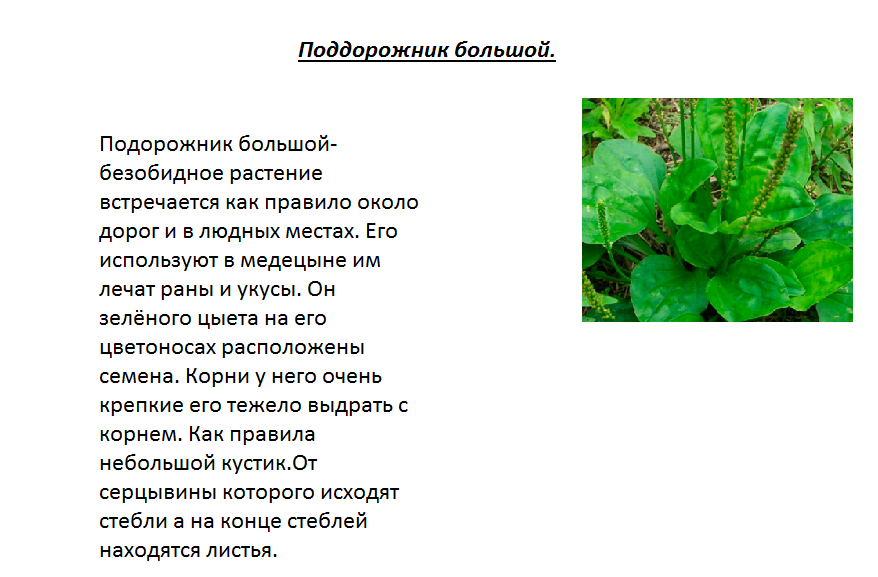

# Инструкция работы с Маркдаун

## Выделение текста

Чтобы выделить текст курсивом необходимо обрамить его звездочками (*),  *пример*

Чтбы выделить текст полужирным, необходимо обрамить его  двойными звездочками (**),  **пример**

Альтернативные способы выделения текста жирными или курсивом нужны для того, чтобы мы могли совмещать оба этих способа. Например, __текст можент быть выделен курсивом и при этом быть **полужирным**__

## Списки

Чтобы добавить ненумерованные списки, необходимо пункты выделить звездочкой (*) или знаком +. Например вот так:
* Элемент 1
* Элемент 2
* Элемент 3
+ Элемент 4

Чтобы добавить нумерованные списки,необходимо пункты просто пронумеровать, например, вот так:
1. Пункт
2. Пункт

## Работа и изображениями

Чтобы вставить изображения в текст, достаточно написать следующее: 

## Ссылки

 *Чтобы оформить ссылкой часть текста используют синтаксис: [текст](ссылка).* 
 Чтобы ссылка бала с подсказкой, для этого в круглых скобках после ссылки нужно поставить пробел и написать текст подсказки в кавычках. Например [будет ссылка с подсказкой](ссылка "А вот и подсказочка") правда она почему то не работает)))*

## Работа с таблицами

## Цитаты

## Заключения