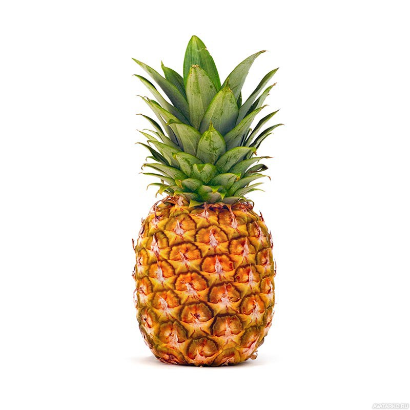

# Инструкция по языку MarkDown

## Cтилизация текста
Обычный текст набираем как есть.

Новая строка.

**Полужирный текс**

*Курсив*

## Цитирование в MarkDown
>Первый уровень цитирования
>> Второй уровень цитирования

## Списки
### Ненумерованный список
* Лист
* Лист

### Нумерованный список
1.Лист
2.Лист

## WEB ссыдки
Текст [пример ссылки](http.exammple.com "Всплывающая подсказка")

# Добавим как добавлять картинки в Markdown 
Это ананас

