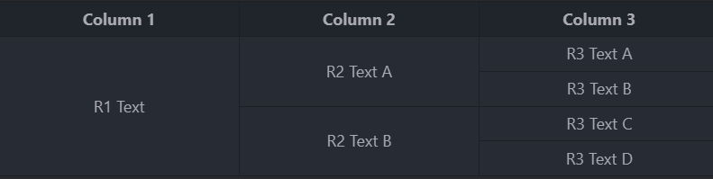

# Инструкция по языку MarkDown

Новая строка - это одна пустая строка

## Выделение текста

Чтобы выделить текст курсивом небходимо обрамить его звёздочками (*) или знаком нижнего подчёркивания (_). Например *вот так* или *вот так*.

Чтобы выделить текст полужирным, необходимо обрамить его двойными звёздочками (**) или двойным знаком нижнего подчёркивания (__).
Например , **вот так** или **вот так**.

Альтернативные способы выделения текста жирным или курсивом нужны для того, чтобы мы могли совмещать оба этих способа.Например, *текст может быть выделен курсивом и при этом быть **полужирным***.

## Списки

Чтобы добавить ненумерованные списки, необходимо пункты выделить звёздочкой (*) или изнаком +.
Например вот так:

* Элемент 1
* Элемент 2
* Элемент 3

+ Элемент 4

Чтобы добавить нумерованные списки, необходимо пункты просто пронумеровать.
Например вот так:

1. Первый пункт
2. Второй пункт

* [x] Lorem ipsum dolor sit amet
* [ ] Lorem consectetur adipisicing elit
* [ ] Lorem ut labore et dfolore

## Работа с изображениями

Чтобы вставить изображение в текст, достаточно написать следующее:


## Ссылки

## Работа с таблицами

Иногда возникает необходимость создать таблицу markdown без заголовка.

Такая простейшая на первый взгляд задача требует довольно креативного подхода. Связано это с тем, что большинство парсеров Markdown не поддерживают таблицы без заголовков. Это означает, что разделительная линия для заголовков является обязательной.

Чтобы сделать таблицу markdown без заголовка, воспользуйся следующей хитростью. Поскольку заголовок все равно обязателен, то вместо текста просто вставь туда специальный код HTML комментария <!--<!-- --> -->:
| <!-- -->      | <!-- -->        | <!-- -->      |
|:-------------:|:---------------:|:-------------:|
| Row 1         | **Bold**        | Cell 3        |
| Row 2         | *Italic*        | Cell 6        |
| Row 3         | ~~Strike~~      | Cell 9        |

В результате мы получим таблицу без заголовка.

Можно создавать таблицы с вертикальными чертами и дефисами. Дефисы используются для создания заголовка каждого столбца, в то время как вертикальные черты разделяют каждый столбец. Вы должны включить пустую строку перед таблицей, чтобы она правильно отображалась. | -

| First Header  | Second Header |
| ------------- | ------------- |
| Content Cell  | Content Cell  |
| Content Cell  | Content Cell  |

Если вы часто редактируете фрагменты кода и таблицы, вам может быть полезно включить шрифт фиксированной ширины во всех полях комментариев на GitHub.

### Форматирование содержимого таблицы

В таблице можно использовать форматирование, например ссылки, встроенные блоки кода и стили текста:
| Command | Description |
| :---: | :---: |
| `git status` | List all *new or modified* files |
| `git diff` | Show file differences that **haven't been** staged |

Текст можно выровнять по левому краю, правому краю или центру столбца, добавив двоеточия слева, справа или по обеим сторонам дефисов в строке заголовка.:

| Left-aligned | Center-aligned | Right-aligned |
| :---         |     :---:      |          ---: |
| git status   | git status     | git status    |
| git diff     | git diff       | git diff      |

Чтобы включить вертикальную черту в качестве содержимого в ячейку, используйте a перед вертикальной чертой:|\

| Name     | Character |
| ---      | ---       |
| Backtick | `         |
| Pipe     | \|        |

### Объединение

Иногда нам может понадобиться еще более изощренное форматирование таблиц, когда нужно объединить несколько ячеек в таблице. Например, вот так:



Скажу сразу, что практически ни в одной реализации Markdown сделать такое стандартными средствами **невозможно**. Ведь согласно спецификации: “если количество ячеек в таблице меньше, чем количество ячеек в строке заголовка, то вставляются пустые ячейки. Если их больше, то избыток игнорируется”.

Поэтому единственный способ, каким можно создать такую таблицу как указано выше - это использовать чистый HTML код. Пример кода для таблицы:

```sh
<table>
    <thead>
        <tr>
            <th>Column 1</th>
            <th>Column 2</th>
            <th>Column 3</th>
        </tr>
    </thead>
    <tbody>
        <tr>
            <td rowspan=4 align="center">R1 Text</td>
            <td rowspan=2 align="center">R2 Text A</td>
            <td align="center">R3 Text A</td>
        </tr>
        <tr>
            <td align="center">R3 Text B</td>
        </tr>
        <tr>
            <td rowspan=2 align="center">R2 Text B</td>
            <td align="center">R3 Text C</td>
        </tr>
        <tr>
            <td align="center">R3 Text D</td>
        </tr>
    </tbody>
</table>
```

<table>
    <thead>
        <tr>
            <th>Column 1</th>
            <th>Column 2</th>
            <th>Column 3</th>
        </tr>
    </thead>
    <tbody>
        <tr>
            <td rowspan=4 align="center">R1 Text</td>
            <td rowspan=2 align="center">R2 Text A</td>
            <td align="center">R3 Text A</td>
        </tr>
        <tr>
            <td align="center">R3 Text B</td>
        </tr>
        <tr>
            <td rowspan=2 align="center">R2 Text B</td>
            <td align="center">R3 Text C</td>
        </tr>
        <tr>
            <td align="center">R3 Text D</td>
        </tr>
    </tbody>
</table>

## Цитаты

# Заключение
