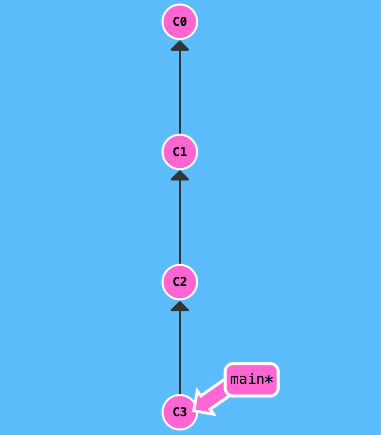

# Инструкция по языку MarkDown (Стилизация текста 1го уровня)

## Стилизация текста 2го уровня

### Стилизация текста 3го уровня

Обычный текст набираем как есть.

Новая строка. начинается с пробела перед предыдущим текстом

**Полужирный текст** - Чтобы выделить текст полужирнымм, необходимо обрамить его двойными звездочками (**) или двойным знаком нижнего подчеркивания (__). Например, **Вот так** или __Вот так__

*Курсив* - Чтобы выделить текст курсивом необходимо обрамить ео звездочками (*) или знаком нижнего подчеркивания (_). Например, *вот так* или _вот так_

### __*Альтернативные способы выделениея текста жирным или курсивом нужны для того, чтобы мы могли совмещать оба этих способа.*__

## Цитирование в языке MarkDodw
Чтобы начать цитированние перед тектом необходимо поставить знак > для первого уровня и >> для второго уровня:
> первый уровень цитирования
>> Второй уровень Цитирования
## Списки
### Ненумерованный список
Чтобы создать ненумерованный список необходимо перед началом текста поставить *:
* Лист 1
* Лист 2
* Лист 3
### Нумерованный список
Чтобы добавить ненумерованные списки необходимо пункты выделить звездочко (*) или знаком (+). Например, вот так:
* Элемент 1
* Элемент 2
* Элемент 3
+ Элемент 4

## WEB ссылки
Чтобы добавить ссылку необходимо заключить текст в квадратные скобки, а сразу после квадратных скобок заключить ссылку в круглые скобки, а внутри указать ссылку при этом можно добавить всплывающую подсказку заключив ее в ковычки. 

Текст [пример ссылки](http.example.com "Всплывающая подсказка")

Также чтобы вставить картинку можно использовать ! и повторить пункт с WEB ссылкой или просто скопировать и вставить с помощью команд **ctrl+C & ctrl+V**
Пример картинки 

Добавим как добавлять картинки в MarkDown

Также чтобы вставить картинку можно использовать ! и повторить пункт с WEB ссылкой или просто скопировать и вставить с помощью команд **ctrl+C & ctrl+V** или можно перетащить картнку в папку с git
Пример картинки 