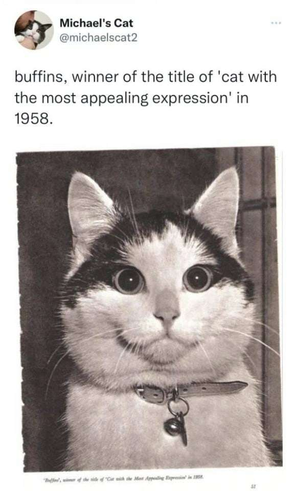

# Инструкция по языку MarkDown

## Стилизация текста
Обычный текст набираем как есть

Новая строка

**Полужирный текст**

*Курсив*

Цитирование в MarkDown
> Первый уровень 
>> Второй уровень

## Списки
### Ненумерованный список
* Лист 1
* Лист 2

### Нумерованный список
1. Лист
2. Лист

## Web ссылки
Текст [пример ссылки](http.example.com 'Всплывающая подсказка')

# Добавим как добавлять картинки в MarkDown
Это котенок
