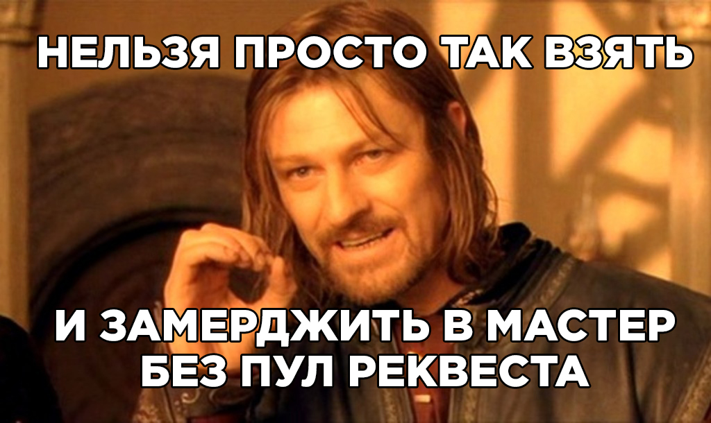

# Инструкция для работы с Markdown

## Параграфы

Чтобы поделить текст на параграфы, между ними нужно оставить пустую строку. Строка считается пустой, даже если в ней есть пробелы и табуляции. Если же строки находятся рядом, то они автоматически склеиваются в одну.

## Выделение текста

Чтобы выделить текст курсивом необходимо обрамить его звездочками (*) или знаком нижнего подчеркивания (_) Например *вот так* или _вот так_.

Чтобы выделить текст полужирным, необходимо обрамить их двойными звездочками (**) или двойным знаком нижнего подчеркивания (__), например **вот так** или __вот так__.

Альтернативные способы выделения текста жирным или полужирным нужны для того, что бы мы могли совмещать оба эти способа. Например: _текст может быть выделен курсивом и при этом быть **полужирным**_.

Выделить фрагмент внутри слова, то это корректно сработает только при использовании звёздочек. Например: Кор*рек*тно, кор**рек**тно, кор***рек***тно

Для переноса строки внутри одного параграфа есть три метода:

поставить в конце строки два или больше пробела   ;\
поставить в конце строки обратную косую черту \;\
использовать HTML-тег  .

Перенос с помощью пробелов  
Перенос с помощью обратного слеша\
Перенос с помощью тега   Последняя строка

## Заголовки

Есть шесть уровней заголовков: от самого большого до самого маленького. Для их выделения используют решётки #, при этом есть несколько тонкостей:

* решётки можно ставить как перед заголовком, так и с двух сторон от него (на уровень заголовка влияют только те #, которые находятся перед ним);

* количество решёток соответствует уровню заголовка: одна для первого уровня, две для второго и так далее;

* между решёткой и текстом ставится пробел.

## Списки

### Нумерованные

Для создания нумерованного списка перед пунктами нужно поставить число с точкой. Неважно, какие именно числа напишете: Markdown пронумерует список автоматически

Например:
1. Первый пункт
2. Второй пункт
3. Третий пункт
1. Четвертый пункт
1. Пятый пункт

Список можно начинать и не с единицы. Для нумерации важно только число, которое стоит перед первым пунктом.

24. Первый пункт
27. Второй пункт
7. Третий пункт

### Ненумерованные

Для создания ненумерованного списка нужно поставить перед каждым пунктом звёздочку *, дефис - или плюс +
Например:
* Первый пункт
* Второй пункт
* Третий пункт
- Первый пункт
- Второй пункт
- Третий пункт
+ Первый пункт
+ Второй пункт
+ Третий пункт

Даже несмотря на то, что не оставляем пустых строк между списками, Markdown относит к разным спискам пункты, перед которыми стоят разные маркеры.

## Работа с изображениями

Перед квадратными скобками нужно поставить восклицательный знак: . Здесь также можно сделать всплывающую подсказку.
Например:

## Ссылки

Чтобы оформить ссылкой часть текста, используется такой синтаксис: [текст](ссылка "подсказка"). Можно сделать всплывающую подсказку при наведении курсора. Для этого в круглых скобках после ссылки нужно поставить пробел и написать текст подсказки в кавычках.

## Работта с таблицами

Столбцы разделяются вертикальными линиями |, а строка с шапкой отделяется от остальных дефисами -, которых можно ставить сколько угодно.
Например:

|Столбец 1|Столбец 2|Столбец 3|
|-|--------|---|
|Длинная запись в первом столбце|Запись в столбце 2|Запись в столбце 3|
|Кртк зпс| |Слева нет записи|

Чтобы выровнять весь столбец по правому краю, в строке с дефисами сразу после дефисов можно поставить двоеточие :. Чтобы выровнять содержимое по центру, надо поставить двоеточия с обеих сторон.

|Столбец 1|Столбец 2|Столбец 3|
|:-|:-:|-:|
|Равнение по левому краю|Равнение по центру|Равнение по правому краю|
|Запись|Запись|Запись|

## Цитаты

Чтобы параграф отобразился как цитата, нужно поставить перед ним закрывающую угловую скобку >. Например:

> Оформление цитатой
последовательных строк
внутри одного параграфа

## Заключение

Этой шпаргалки будет достаточно для создания полноценного документа. А там, где возможностей языка не хватит, можно встраивать HTML-код.

Синтаксис Markdown простой, гибкий и нетребовательный. У него есть несколько реализаций, благодаря которым в нём можно:

*выделять параграфы и переносить строки,\
*оформлять заголовки,\
*изменять начертание текста,\
*выделять цитаты,\
*составлять списки,\
*прикреплять ссылки,\
*вставлять картинки,\
*делать таблицы.

## Как добавлят картинки в MarkDown
Это картинка

# Удаленные репозитории

## Клонирование

Клонирование - это когда вы копируете удаленный репозиторий к себе на локальный ПК/ Чтобы склонировать проект,
сперва, необходимо узнать где он расположен и скопировать ссылку на него. В нашем руководстве мы будем использовать адрес
https://github.com/tutorialzine/awesome-project/ При клонировании в текущий каталог, там будет создана папка, в которую поместятся все проектные файлы и скрытая директория .git, с самим репозиторием, или с необходимой информацией о нем.

git clone https://github.com/tutorialzine/awesome-project

## Подключение к удаленному репозиторию

Чтобы связать наш локальный репозиторий с репозиторием на GitHub, выполним следующую команду в терминале. Обратите внимание, что
нужно обязательно изменить URI репозитория на свой.

git remote add origin https://github.com/tutorialzine/awesome-project.git

## Отправка изменений на сервер

Команда, предназначенная для этого - push

git push

## Запрос изменений с сервера

Если вы сделали изменения в удаленном репозитории, другие пользователи могут скачать изменения при помощи команды pull.

git pull