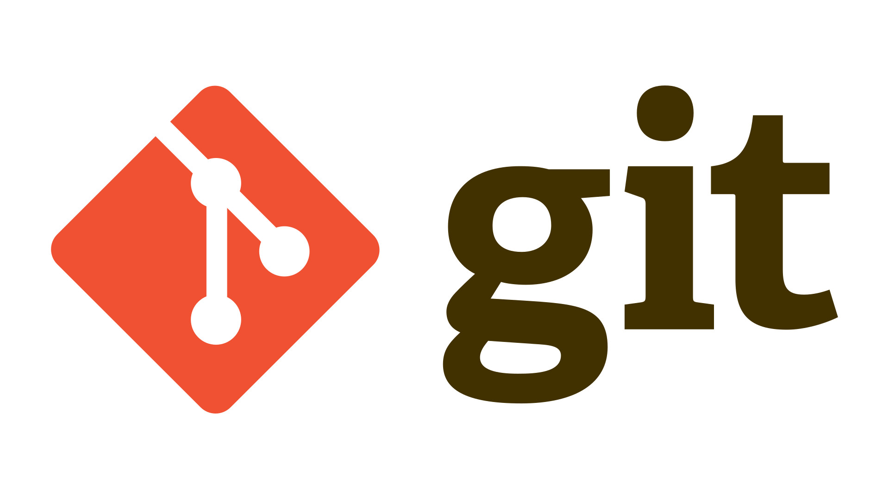

# Инструкция для работы с MD

## Выделение текста

Чтобы выделить текст курсивом необходимы звездочки. Напрмиер *вот так* или одно нижнее подчеркивание _вот так_

ЧТобы выделить текст полужирным необходимо обрамить двойными звездочками **вот так** или знаком нижнего подчеркивания __вот так__

Альтернативные способы выделения текста жирным или курсивом нужны для того, чтобы мы могли совмещать оба этих способа __вот *так*__

## Списки
Чтобы выделить ненумерованный список используйте (*) или знак +
В ненумерованных списках пункты выделяем звездочкой вот так:

* Элемент 1
* Элемент 2
* Элемент 3
+ Элемент 4

Нумерованные списки необходимо просто пронумеровать. Вот так
1. Элемент 1
2. Элемент 2
3. Элемент 3

## Работа с изображением
Чтобы вствить картинку в текст достаточно написать : 

## Ссылки

Чтобы добавить ссылку можно сделать вот так:
Ссылка на красивый цветочек [ссылка](https://papik.pro/izobr/uploads/posts/2023-03/1679451580_papik-pro-p-kartina-dlya-detei-tsvetok-23.png "Всплывающая подсказка") 

## Цитаты

Цитаты можно добавить через знак ">"
> Первый уровень цитирования
>> Второй уровень цитирования

## Инструкция по работе с удаленным репозиторием

1. создали аккаунт на github.com
2. создать локальный репозиторий
3. подружить локальный и удаленный репозитории. Github подскажет как это сделать
4. отправить локальный репозиторий (push) в удаленный на github, возможно, будет необходима авторизация
5. провести изменения с другого ПК (с гитхаба)
6. выкачать коммит (pull) актуальное состояние из удаленного репозитория.

## Фикс изменений по файлу с гитхаба
1. Делаем (fork) интересующего нас аккаунта
2. делает git clone для нашей версиии этого репозитория
3. Мы создаем ветку с предлагаемымми изменениями
4. производим все изменения только в этой ветке
5. Отправлляем эти изменения на свой аккаунт (push)
6. в окне гитхаб появляется возможность отправить pull request

проверка сохранения вносимых изменений

добавили коммит с github
